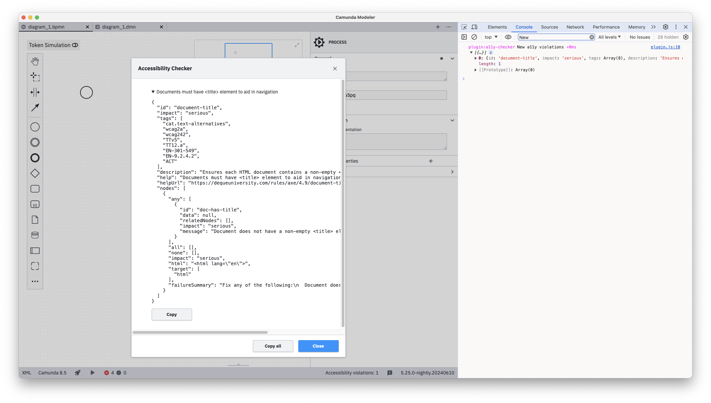

# A11y checker

[Camunda Desktop Modeler](https://github.com/camunda/camunda-modeler) plugin which detects accessibility issues with [axe-core](https://github.com/dequelabs/axe-core) and prints them to the console.

## How it looks like

## Installation

Put this directory into the `plugins` directory of the Camunda Modeler and you're ready to go. Check [the plugins documentation](https://docs.camunda.io/docs/components/modeler/desktop-modeler/plugins/) for the exact location.

## Usage

The plugin runs automatically in the background once you open the application. Look for console messages starting with `plugin:a11y-checker`.

Use the button in the status bar to track detected violations. Once you click it, all collected violations are displayed.
